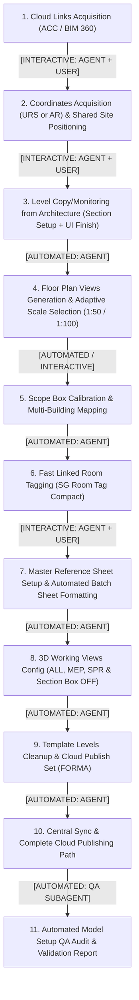

# Complete Revit MEP Model Initialization & Setup Workflow

This document standardizes the end-to-end process of taking a blank or template Revit MEP model (e.g. Fire Protection / Sprinklers SPR, Plumbing PLB, HVAC MEH, Electrical ELC) and fully preparing it for modeling and production sheet delivery.

---

## Workflow Overview & Automation Boundary Map



---

## ⚠️ CRITICAL EXECUTION PROTOCOL: STATE MACHINE GATING (ZERO STEP-SKIPPING)

The agent MUST strictly obey the following execution rules when running this skill:

1. **STRICT SEQUENTIAL PROGRESSION (Steps 1 through 11)**:
   - The workflow MUST proceed in exact numerical sequence: `Phase 1 -> Phase 2 -> Phase 3 -> Phase 4 -> Phase 5 -> Phase 6 -> Phase 7 -> Phase 8 -> Phase 9 -> Phase 10 -> Phase 11`.
   - **ZERO JUMPING**: It is STRICTLY FORBIDDEN to skip steps (e.g. going from Step 1 directly to Step 4, or skipping Step 2, 3, 5, 7).
   - Every single step must be explicitly announced and executed.

2. **MANDATORY STATE BANNER ON EVERY TURN**:
   Every response from the agent MUST start with this state tracking banner:
   ```markdown
   ## 📍 [MODEL SETUP: STEP X OF 11 — <PHASE NAME>]
   **Status**: 🟡 WAITING FOR USER INPUT / ⚙️ EXECUTING / 🟢 COMPLETED
   ```

3. **INTERACTIVE CHECKPOINTS (HARD STOP & YIELD TO USER)**:
   - At every `[INTERACTIVE]` phase (Phases 1, 2, 3, 5 if multi-building, 7, 10):
     1. Perform automated preparations (if applicable).
     2. Output the state banner and clear, concise instructions or candidate list for the user.
     3. **STOP CALLING TOOLS IMMEDIATELY AND YIELD EXECUTION TO THE USER**.
     4. DO NOT call any tool for Phase $N+1$ until the user has explicitly responded in chat.

4. **AUTOMATED PHASES ADVANCEMENT (Phases 4, 6, 8, 9, 11)**:
   - Perform the automated task completely.
   - Report the exact metrics (e.g., plans created, tags placed, publish set created).
   - Automatically advance to the next step and display its banner.

---

## Step-by-Step Workflow Specification

### Phase 1: Cloud Discipline Models Linking (Autodesk Docs / ACC)
* **Execution Mode**: `[INTERACTIVE: AGENT + USER]` (Automated cloud search + User candidate selection)
* **CHECKPOINT**: 🛑 **HARD STOP AFTER SCANNING. Present numbered candidate list to user and WAIT for user selection.**
* **MANDATORY CANDIDATE PROMPT RULE**:
  - The agent MUST NEVER link all cloud files automatically.
  - The agent MUST scan Autodesk Docs, find all `.rvt` models in the project, and ALWAYS present a numbered list of candidate models to the user (clearly separating Tower, Park/Basement, URS, etc.) and ask the user to confirm which specific models to link.
* **Execution Logic**:
  1. Internal 3-legged APS OAuth token extracted dynamically via SSONET.dll (`Autodesk.Revit.AdWebServicesBase.GetInstance().GetOAuth2AccessToken()`).
  2. Parse cloud manifest / PacCache / CollaborationCache or Data Management API (`https://developer.api.autodesk.com/data/v1/projects/{pid}/folders/{fid}/contents`) to resolve `modelGuid` for each discipline model.
  3. Create native cloud paths using `ModelPathUtils.ConvertCloudGUIDsToCloudPath(region, project_guid, model_guid)`.
     - **Active View & Dialog Rule**: Ensure active view is a graphical view (3D/Plan, not `DrawingSheet`) and subscribe to `uiapp.DialogBoxShowing` to prevent `NullReferenceException` and blocking dialogs during `RevitLinkType.Create`.
  4. **Workset Provisioning & Link Assignment**:
     - **Strict Isolation Rule**: Every link (`RevitLinkType` and `RevitLinkInstance`) MUST reside in a dedicated user workset with prefix `Link `. NEVER place links into default worksets (`Workset1`, `Shared Levels and Grids`, or MEP modeling worksets).
     - **Standard Discipline Mapping**:
       - `URS` (Coordinates / Site Base) -> `Link URS`
       - `AR` / `ARH` (Tower / Buildings) -> `Link ARH Buildings`
       - `AR` / `ARH` (Basement / Parking) -> `Link ARH Basement`
       - `ST` / `STR` (Structure) -> `Link STR`
       - `ME` / `MEH` (Mechanical / HVAC) -> `Link MEH`
       - `EL` / `ELC` (Electrical) -> `Link ELC`
       - `PL` / `PLB` (Plumbing / Sanitation) -> `Link PLB`
       - `PN` / `PNM` (Pneumatics / Pneumatic Waste) -> `Link PNM`
       - `FP` / `SPR` (External Fire Protection) -> `Link SPR`
     - **Non-Standard / Untypical Links Handling (Dynamic Workset Synthesis)**:
       - For specialized consultant models (e.g. Landscape, Kitchen, Facade, Elevators, Pool, Civil, Acoustics, Medical Gas, Tenant Fitout):
         1. Parse filename tokens to extract discipline/system descriptor (e.g. `LAND`, `KITCH`, `FACADE`, `ELEV`, `POOL`, `CIVIL`, `ACOUST`, `MED`, `TENANT`).
         2. Synthesize workset name: **`Link <DISCIPLINE_DESCRIPTOR>`** (e.g. `Link LAND`, `Link KITCHEN`, `Link FACADE`, `Link ELEVATORS`, `Link CIVIL`).
         3. Dynamic Workset Provisioning via Revit API:
            ```python
            # Query existing user worksets; create if missing
            ws_name = "Link {}".format(clean_descriptor)
            existing_ws = [ws for ws in FilteredWorksetCollector(doc).OfKind(WorksetKind.UserWorkset) if ws.Name == ws_name]
            if not existing_ws:
                ws = Workset.Create(doc, ws_name)
                ws_id = ws.Id
            else:
                ws_id = existing_ws[0].Id
            # Assign workset parameter to RevitLinkInstance
            link_instance.get_Parameter(BuiltInParameter.ELEM_PARTITION_PARAM).Set(ws_id.IntegerValue)
            ```
         4. Candidate list presented to user MUST explicitly show the target workset name for each model (both standard and untypical).

---

### Phase 2: Coordinates Acquisition & Manual Shared Site Positioning
* **Execution Mode**: `[AUTOMATED: AGENT]` (Coordinates Acquisition) + `[MANUAL: USER UI]` (Shared Site Positioning per Link)
* **CHECKPOINT**: 🛑 **HARD STOP AFTER ACQUIRING COORDINATES. Instruct user to set Shared Site in Properties Palette and WAIT for user confirmation.**
* **Step 2.1: Coordinate Acquisition (Agent Automated)**:
  1. **Primary Source (URS)**: Check for `URS` link instance. If present, execute `doc.AcquireCoordinates(urs_instance.Id)` from the URS model.
  2. **Fallback Source (Architecture)**: If `URS` is NOT present in the project, automatically acquire coordinates from the Architectural model (`AR` / `ARH` link instance): `doc.AcquireCoordinates(arh_instance.Id)`.
  3. Verify coordinate acquisition success and report acquired Survey / Project Base Point state.
* **Step 2.2: Shared Site Link Positioning (Manual User Action in UI)**:
  - *Why Manual is Required*: In Revit, linked model positions cannot and must not be translated via custom artificial matrix math in API scripts. Each link instance must use native Revit Shared Coordinates / Shared Site positions.
  - **User Action in Revit UI**:
    1. Select each linked model instance (`STR`, `MEH`, `ELC`, `PLB`, `ARH`, etc.).
    2. In the **Properties Palette** (Свойства), locate parameter **Shared Site** (Площадка / Shared Site).
    3. Click on the button next to Shared Site -> select **"Move instance to: Shared Coordinates"** (Переместить экземпляр в: Общие координаты) or select the active site position.
    4. Confirm that all discipline geometry aligns precisely in 3D.

---

### Phase 3: Level Copy/Monitoring from Architecture
* **Execution Mode**: `[AUTOMATED: AGENT]` (View & Workset Preparation) + `[MANUAL: USER UI]` (Copy/Monitor Finalization, 10-15s)
* **CHECKPOINT**: 🛑 **HARD STOP AFTER CREATING SECTION VIEW. Instruct user to run Copy/Monitor and WAIT for user confirmation.**
* **Agent Automated Preparation**:
  1. **Workset Switch**: Automatically sets the active host workset to **`Shared Levels and Grids`** before creating or copying levels.
  2. **Dedicated Clean Section View**: Creates or updates section view **`00_Setup_CopyMonitor_Levels`**:
     - **Active View Rule**: Active view must be a model view (3D/Plan), not a `DrawingSheet`, prior to creating views or links.
     - **Vertical Section Transform Rule**: In .NET/PythonNet, `Transform` is a value struct. NEVER mutate `sec_box.Transform.BasisY` in place (alters temporary copy, defaulting to `Transform.Identity` which renders looking down as a plan). Always instantiate `t_box = Transform.Identity`, set `t_box.BasisY = XYZ(0, 0, 1)` (global $Z$ as Up), `t_box.BasisZ = view_dir`, `t_box.BasisX = t_box.BasisY.CrossProduct(t_box.BasisZ)`, and assign `sec_box.Transform = t_box`.
     - Sized to encompass the entire building geometry and all level datums.
     - **Clean Isolation**: Only the Architectural link (`AR` / `ARH`), Levels, and Grids are visible. All other discipline links and MEP model categories are hidden.
* **User Action in Revit UI (10-15 seconds)**:
  1. On ribbon: **Collaborate** -> **Copy/Monitor** -> **Select Link** -> click architectural model.
  2. Click **Copy** -> check **Multiple** -> window-select all levels -> click **Finish** (options bar) -> click **Finish** (green check on ribbon).

---

### Phase 4: Floor Plan Views Generation & Scale Selection Rule (All Buildings)
* **Execution Mode**: `[AUTOMATED: AGENT]`
* **Scale Standard & Dual-Orientation Sheet Fit Algorithm**:
  - **Primary Preference**: Default to **Scale 1:50** for all building floor plans across all buildings in the project.
  - **DUAL-DIMENSION & ROTATION FIT CHECK (Fixed Height vs Expandable Width)**:
    - Sheet height is strictly fixed at 900 mm (max printable height $\approx 820\text{ mm}$) and cannot be expanded.
    - Sheet width is expandable starting from standard usable width $\approx 780\text{ mm}$ via parametric `Custom L` steps (+100 mm each).
    - Calculate both plan dimensions at 1:50:
      $$\text{Dim}_X\text{ (mm)} = \frac{\text{ScopeBox Width (mm)}}{50}, \quad \text{Dim}_Y\text{ (mm)} = \frac{\text{ScopeBox Height (mm)}}{50}$$
    - **Case 1: Direct Fit (0° Rotation)**:
      - If $\text{Dim}_Y \le 820\text{ mm}$: Keep direct orientation at **Scale 1:50**.
      - If $\text{Dim}_X > 780\text{ mm}$, expand width parametrically: $\text{Custom L} = \lceil (\text{Dim}_X - 780) / 100 \rceil$.
    - **Case 2: Rotated Fit (90° Rotation)**:
      - If $\text{Dim}_Y > 820\text{ mm}$, but $\text{Dim}_X \le 820\text{ mm}$: The plan **CAN fit at Scale 1:50 with 90° viewport rotation**.
      - In this case, $\text{Dim}_X$ becomes the vertical dimension ($\le 820\text{ mm}$), and $\text{Dim}_Y$ becomes the horizontal dimension (expanded via $\text{Custom L} = \lceil (\text{Dim}_Y - 780) / 100 \rceil$).
    - **Case 3: Fallback to Scale 1:100 (Both Dimensions Exceed Height)**:
      - If **BOTH** $\text{Dim}_X > 820\text{ mm}$ AND $\text{Dim}_Y > 820\text{ mm}$: The plan physically cannot fit into the fixed sheet height in any orientation $\rightarrow$ **MUST automatically switch to Scale 1:100**.
* **Typical Floors Identification Algorithm (Per Building)**:
  1. The agent scans the architectural link (`...AR...`) across all copied levels per building/tower.
  2. Compares **Room Count**, **Wall Count**, and **Total Spatial Area (m2)** per level for each building.
  3. Spans of identical floors are grouped into typical blocks (e.g. `A_03`-`A_05`, `B_03`-`B_05`, `A_10`-`A_12`).
  4. The first floor of each typical block is designated as the **Master Typical View** and given the suffix **`t`** (e.g. `50_A_03t`, `50_B_03t`, `50_A_10t`).
* **Generation & Naming**:
  1. Create FloorPlan views for all copied levels across all buildings (`50_A_02`, `50_B_02` / `100_A_02`).
  2. Master typical floor plan is automatically named with suffix **`t`** (e.g. `50_A_03t`, `50_B_03t`).
  3. Assign View Template **`SPR PRESS`** (Scale 1:50 or 1:100) and hide `Toposolid`/`Topography`.

---

### Phase 5: Scope Box Framing & View Range Calibration
* **Execution Mode**: `[AUTOMATED: AGENT]` + `[INTERACTIVE: AGENT + USER]` (for multi-building setups)
* **CHECKPOINT**: 🛑 **HARD STOP IF MULTIPLE BUILDINGS DETECTED. Present proposed mapping table to user and WAIT for user confirmation.**
* **Scope Box Copying & Geometric Calibration**:
  1. **Copy Scope Boxes**: Copy all Scope Boxes (`BLDNG A`, `BLDNG B`, `Grids and Levels`, `Stair...`) from the architectural link.
  2. **Geometric Boundary Comparison & Adjustment**:
     - Compare copied Scope Box 3D extents against the actual building geometry (outer walls, balconies, roof envelope) from the architectural link.
     - Adjust and correct Scope Box boundaries if they are misaligned, overly wide, or clipping building geometry, ensuring tight, complete coverage with standard margins.
  3. **Assign to Views (Multi-Building & Multi-Part Mapping)**:
     - **Single Building**: Automatically assigns the primary building Scope Box (e.g. `BLDNG A`) to all generated floor plans.
     - **Multiple Buildings / Sections / Parts** (e.g. `BLDNG A`, `BLDNG B`, `PARK`, `PODIUM`, `TOWER 1`, `TOWER 2`):
       - Agent geometrically correlates the 3D bounding box of each Scope Box with the corresponding building footprint and view prefixes (`50_A_*`, `50_B_*`).
       - **MANDATORY USER CONFIRMATION**: When multiple buildings or sectional Scope Boxes are detected, the agent MUST output the proposed mapping table (Scope Box $\leftrightarrow$ Floor Plans) and request user confirmation before applying.
  4. **Crop Settings**: Enable **`CropBoxActive = True`**, set **`CropBoxVisible = False`** (hide crop boundary), enable **`Annotation Crop = True`**.
* **View Range**:
  - **Cut Plane**: Associated Level + **`140 cm`** (1400 мм)
  - **Top Clip Plane**: Level Above - **`30 cm`** (-300 мм)
  - **Bottom / Depth**: Associated Level + **`0.0 cm`**

---

### Phase 6: Automated Room Tagging via Architectural Link (SG Autotagging Room)
* **Execution Mode**: `[AUTOMATED: AGENT]`
* **Implementation Engine**: `SGTools.tab/SGPyT.panel/RoomTags.pulldown/Autotagging room.pushbutton`
* **Standard Tag Configuration**:
  - **Tag Family**: **`SG Room Tag Compact - Simple`** (or `Compact - Area`)
  - **Minimum Area Filter**: **`2.0 m2`** (filters out minor shafts, niches, and voids under 2 sq.m).
* **Execution Logic**:
  1. Gathers spatial `OST_Rooms` from linked architecture with `Area >= 2.0 m2`.
  2. Uses fast geometric pre-filter: Z-elevation check (`|p.Z - view.Z| < 15 ft`) and CropBox inverse matrix bounding check.
  3. Replaces / creates native linked room tags via `DB.LinkElementId` and `Create.NewRoomTag`.

---

### Phase 7: Master Reference Sheet Layout & Batch Sheet Assembly
* **Execution Mode**: `[INTERACTIVE: AGENT + USER]` (User configures Master Sheet -> Agent batch-formats all sheets)
* **CHECKPOINT**: 🛑 **HARD STOP BEFORE BATCH ASSEMBLY. Ask user for Master Sheet number(s) and WAIT for user confirmation.**
* **Master Reference Sheet Protocol**:
  1. **User Setup**: The user configures one or more **Master Reference Sheets** in Revit (e.g. `SPR-102` for above-ground floors, `SPR-099` for parking/basement) with:
     - Preferred Titleblock width (`Custom width`, `Custom L`).
     - Exact Viewport placement coordinate (`XYZ`), rotation ($0^\circ$ / $90^\circ$), and title position.
     - Standard details, notes, and schedules placed in the reserved right-hand column.
  2. **User Notification**: The user informs the agent of the designated master reference sheet(s) (or agent queries the reference sheet).
* **Agent Automated Batch Assembly & Formatting**:
  1. **Sheet Creation & Naming (Hebrew Standards)**:
     - **Basement Floors (below 0.00 / BS / Martef)**:
       - **Naming**: **`מתזים. תוכנית קומת מרתף [N]`**
       - **Reverse Sheet Numbering**: `SPR-099` (BS-1), `SPR-098` (BS-2), `SPR-097` (BS-3), `SPR-096` (BS-4)...
     - **Above-ground Individual Floors**:
       - **`מתזים. תוכנית קומה [N]`** (`SPR-102`, `SPR-106`...)
     - **Typical Floors (Typical spans)**:
       - **`מתזים. תוכנית קומה טיפוסית [Start]-[End]`** (e.g. `SPR-103`: `מתזים. תוכנית קומה טיפוסית 3-5`, `SPR-110`: `מתזים. תוכנית קומה טיפוסית 10-12`, `SPR-113`: `מתזים. תוכנית קומה טיפוסית 13-16`).
     - **Roof**:
       - **`מתזים. תוכנית גג`**, **`מתזים. תוכנית גג טכני`** (`SPR-122`)
  2. **Viewport Placement & Alignment**:
     - Automatically places each corresponding floor plan onto its sheet.
     - Moves/centers the viewport to match the exact placement coordinates (`XYZ`) and rotation from the master reference sheet.
  3. **Detail, Legend & Annotation Replication**:
     - Collects all details via `OfCategory(BuiltInCategory.OST_GenericAnnotation)` and schedule graphics via `OfClass(ScheduleSheetInstance)` from the master reference sheet.
     - Replicates them onto all target sheets at identical coordinates:
       ```python
       ElementTransformUtils.CopyElements(source_sheet, List[ElementId](ids_to_copy), dest_sheet, Transform.Identity, CopyPasteOptions())
       ```

---

### Phase 8: 3D Working Views Visibility Configuration (PRESS / 3D View)
* **Execution Mode**: `[AUTOMATED: AGENT]`
* **General 3D Setting**: **`Section Box` IS ALWAYS DISABLED (`IsSectionBoxActive = False`)** on working coordination 3D views.
* **Configuration Rules for 3D Views under PRESS tree**:
  1. **`ALL`**:
     - **Purpose**: Full multidisciplinary coordination (Architecture + Structure + All MEP disciplines).
     - **Links**: Only **`URS`** is hidden. All others (`AR`, `STR`, `ME`, `EL`, `PL`) are **visible**.
     - **Section Box**: **Disabled**.
  2. **`MEP`**:
     - **Purpose**: Coordination between MEP disciplines.
     - **Links**: Only MEP disciplines are visible (**`ME`, `EL`, `PL`**). Links `URS`, `AR`, `STR` are **hidden**.
     - **Section Box**: **Disabled**.
  3. **`SPR`**:
     - **Purpose**: Isolated working modeling view for sprinkler systems.
     - **Links**: **All external links are hidden**. Only host model SPR geometry is displayed.
     - **Section Box**: **Disabled**.

---

### Phase 9: Template Placeholder Levels Cleanup & Cloud Publish Set Generation (FORMA)
* **Execution Mode**: `[AUTOMATED: AGENT]`
* **Template Placeholder Cleanup**:
  - Before creating the publish set and uploading to cloud, the agent MUST delete initial blank template levels (`Level 0` / `Level 00`, `Level 1` / `Level 01`) that existed in the blank template prior to Copy/Monitor.
* **Set Name**: **`FORMA`**
* **Included Views & Sheets**:
  1. **Starting Sheet**: `000 - starting view` (also configured as the project's Starting View).
  2. **3D Views**: `ALL`, `MEP`, `SPR` (with Section Box disabled and discipline links configured).
  3. **Sheets**: `SPR-096`..`SPR-099` (basement) or `SPR-102`..`SPR-122` (tower) - all assembled production sheets.
* **Execution**:
  - Created via `PrintManager.ViewSheetSetting` and saved as `ViewSheetSet` named **`FORMA`**.
  - Configured as active cloud publish set for Autodesk Docs (BIM 360 / ACC).

---

### Phase 10: Automated Synchronize with Central & Cloud Publishing Specification
* **Execution Mode**: `[AUTOMATED: AGENT]` (Sync) + `[MANUAL: USER UI]` (Docs Publish)
* **CHECKPOINT**: 🛑 **HARD STOP AFTER CENTRAL SYNC & QA AUDIT. Output complete hierarchical cloud path and prompt user to Publish Latest in Revit Home.**
* **Automated Synchronization Engine**:
  - Agent automatically executes `doc.SynchronizeWithCentral(TransactWithCentralOptions(), sync_opts)`:
    - Sets `RelinquishOptions(True)` (relinquishes User, View, Family, Standard worksets and Checked Out elements).
    - Sets `SaveLocalBefore = True` and `SaveLocalAfter = True`.
    - Commits descriptive comment: `"Antigravity: Complete model setup, views, sheets, Publish Set FORMA"`.
* **Mandatory Hierarchical Cloud Path Output**:
  - Whenever directing the user to publish, link, or find cloud models in Revit Home / Autodesk Docs, the agent **MUST ALWAYS OUTPUT THE COMPLETE HIERARCHICAL PATH INCLUDING ALL SUBFOLDERS**:
    - **Account / Hub**: e.g. `PRASHKOVSKY MENIVIM LTD`
    - **Project**: e.g. `TLV SD 2203`
    - **Full Folder Tree**: e.g. `Project Files` -> `Revit model` -> `Sprinklers`
    - **Model File Name**: e.g. `SD-2203-FP-R25-TOWER.rvt`
    - **Action**: In Revit Home navigate along this path and click **Publish Latest**.

---

### Phase 11: Automated Model Setup QA Audit & Integrity Validation (QA Subagent)
* **Execution Mode**: `[AUTOMATED: QA SUBAGENT]` (Read-only background inspection & compliance scoring)
* **Purpose**: While the main agent coordinates final synchronization and prepares the summary, a specialized QA subagent runs a comprehensive, read-only 8-point audit checklist across the active Revit model to certify complete setup compliance without blocking or slowing user interaction.
* **Core 8-Point Audit Checklist**:
  1. **Link Workset Isolation Check**:
     - Query all `RevitLinkInstance` and `RevitLinkType` elements.
     - Validate that 100% of links reside in dedicated user worksets with prefix `Link ` (e.g. `Link ARH Buildings`, `Link STR`, `Link URS`).
     - Flag any link residing in default worksets (`Workset1`, `Shared Levels and Grids`, modeling worksets).
  2. **Coordinate & Shared Positioning Check**:
     - Verify `ProjectLocation` and Survey Point coordinates are properly acquired and non-default.
  3. **Level Hygiene & Template Cleanup Check**:
     - Confirm all placeholder/template levels (e.g. `Level 0`, `Level 1`, `Level 00`, `Level 01`) have been completely deleted.
     - Confirm all remaining levels are actively associated with copied floor plans.
  4. **Floor Plan Views & Scope Box Calibration Check**:
     - Confirm all generated plans have View Template **`SPR PRESS`** assigned.
     - Confirm every floor plan view has a valid Scope Box assigned, with `CropBoxActive = True`, `CropBoxVisible = False`, and `AnnotationCrop = True`.
     - Confirm master typical floor plans are properly suffixed with **`t`** (e.g. `50_A_03t`).
  5. **Linked Room Tagging Coverage Check**:
     - Verify room tag presence across all generated floor plans.
     - Calculate ratio of placed room tags against candidate linked rooms ($\ge 2.0\text{ m}^2$) to catch any missed zones or unhosted tags.
  6. **Sheet Assembly & Viewport Alignment Check**:
     - Verify every production sheet has exactly one primary floor plan viewport placed.
     - Verify replicated titleblock details (`OST_GenericAnnotation`) and schedule instances exist at matching coordinates.
     - Validate reverse numbering on basement sheets (`SPR-099` down) and typical range naming (`מתזים. תוכנית קומה טיפוסית X-Y`).
  7. **3D Coordination Views Configuration Check**:
     - Confirm views **`ALL`**, **`MEP`**, **`SPR`** exist under the PRESS view tree.
     - Validate **`IsSectionBoxActive == False`** on all 3 views.
     - Verify link visibility overrides (e.g. only `URS` hidden on `ALL`; only MEP visible on `MEP`; all links hidden on `SPR`).
  8. **Cloud Publish Set (FORMA) Integrity Check**:
     - Query `FilteredElementCollector(doc).OfClass(ViewSheetSet)`.
     - Verify set named **`FORMA`** exists and includes: starting sheet `000`, 3D views `ALL, MEP, SPR`, and 100% of generated production sheets.
* **Subagent Output Format**:
  The QA subagent compiles a concise audit table presented to the user:
  ```markdown
  ### BIM Model Setup QA Audit Report
  | # | Quality Gate Check | Status | Details / Metrics |
  |---|---|:---:|---|
  | 1 | Link Workset Isolation | ✅ PASS | 7/7 links in 'Link ...' worksets |
  | 2 | Coordinate Acquisition | ✅ PASS | Acquired from URS model |
  | 3 | Level Template Cleanup | ✅ PASS | 0 placeholder levels remaining |
  | 4 | Floor Plans & Scope Box | ✅ PASS | 18 plans configured with SPR PRESS & Scope Boxes |
  | 5 | Linked Room Tagging | ✅ PASS | 142 rooms tagged (min area >= 2.0 m2) |
  | 6 | Sheet Batch Assembly | ✅ PASS | 18 sheets assembled with details & alignment |
  | 7 | 3D Views (Section Box OFF)| ✅ PASS | ALL, MEP, SPR configured correctly |
  | 8 | Cloud Publish Set (FORMA) | ✅ PASS | Starting view + 3D views + 18 sheets included |
  ```

---

## Summary Matrix: Roles & Responsibilities

| Workflow Phase | Responsible Role | Agent Responsibility | User Responsibility |
| :--- | :---: | :--- | :--- |
| **1. Cloud Link Acquisition** | `[INTERACTIVE]` | Scans cloud model GUIDs, **outputs numbered candidate list** | Selects target candidate numbers (Tower / Basement) |
| **2. Shared Coordinates & Link Positioning** | `[INTERACTIVE]` | Acquires coordinates from URS (or AR fallback), verifies Project Base Point | Sets Shared Site parameter to "Shared Coordinates" for each link instance in Revit UI |
| **3. Copy/Monitor Levels** | `[INTERACTIVE]` | **Switches active workset to `Shared Levels and Grids`**, creates full geometry section | In Revit UI: Collaborate -> Copy/Monitor -> Select Link -> Multiple -> box select -> Finish (~10s) |
| **4. Floor Plan Generation** | `[AUTOMATED]` | Evaluates both dimensions against 820mm fixed height, applies 1:50 (with 90° rotation if needed) or 1:100, typicals with `t` suffix, applies `SPR PRESS` | None |
| **5. Scope Box & View Range** | `[INTERACTIVE]` | Copies Scope Boxes, correlates bounds with building footprints, prompts user mapping for multiple buildings, enables Annotation Crop, sets View Range | Confirms Scope Box <-> View mapping if model contains multiple buildings/parts |
| **6. Automated Room Tagging** | `[AUTOMATED]` | Places **`SG Room Tag Compact`** tags with **`Min Area >= 2.0 m2`** filter | None |
| **7. Master Reference Sheet & Batch Assembly** | `[INTERACTIVE]` | Batch-creates sheets, places viewports at reference coordinates, copies all details, schedules, and legends | Sets up Master Reference Sheet(s) in Revit and notifies the agent |
| **8. 3D Views Config (ALL, MEP, SPR)** | `[AUTOMATED]` | Configures link visibility per discipline and **disables Section Box** on all three views | None |
| **9. Cloud Publish Set (FORMA)** | `[AUTOMATED]` | Deletes blank template levels, generates **`FORMA`** set (`000` starting view + sheets + 3D views `ALL, MEP, SPR`) | None |
| **10. Central Sync & Publishing Path** | `[INTERACTIVE]` | Executes automated sync with relinquishment, outputs complete cloud path (Hub -> Project -> Folders -> File) | Clicks **Publish Latest** in `Revit Home` |
| **11. Automated Model Setup QA Audit** | `[AUTOMATED: QA SUBAGENT]` | Executes 8-point read-only audit checklist, validates workset isolation, views, sheets, and FORMA set | Reviews final QA validation report |
